Duke Nukem 3D
=============

Duke Nukem 3D is a classic first-person shooter originally developed by 3D Realms. For a full description, please refer to the [Wiki article](https://en.wikipedia.org/wiki/Duke_Nukem_3D) about this game. This project aims to bring the GP2X port of Duke Nukem 3D by **Woogal**, known as Duke2X 03/07/07 Version 0.04, to EZX and MotoMAGX phones by Motorola.

## Screenshots

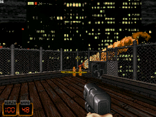 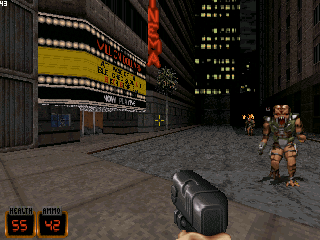 

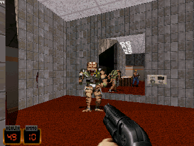 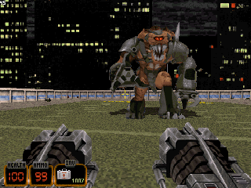

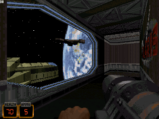 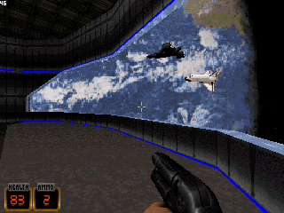 

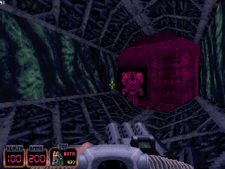 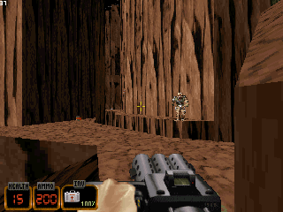

## Photos

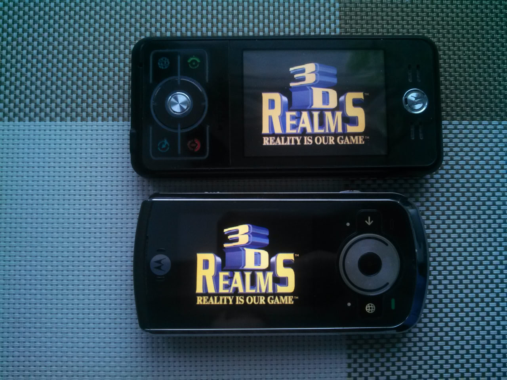

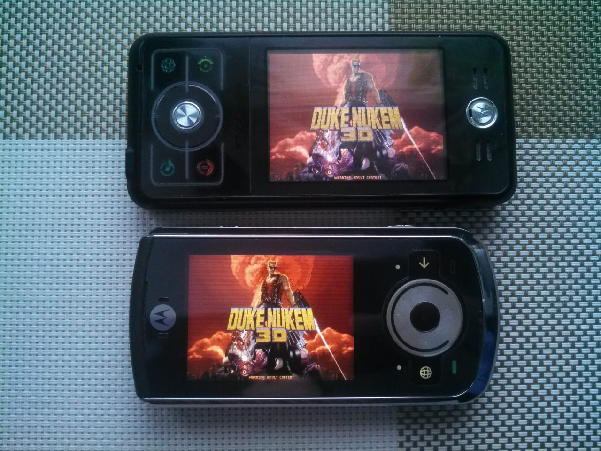

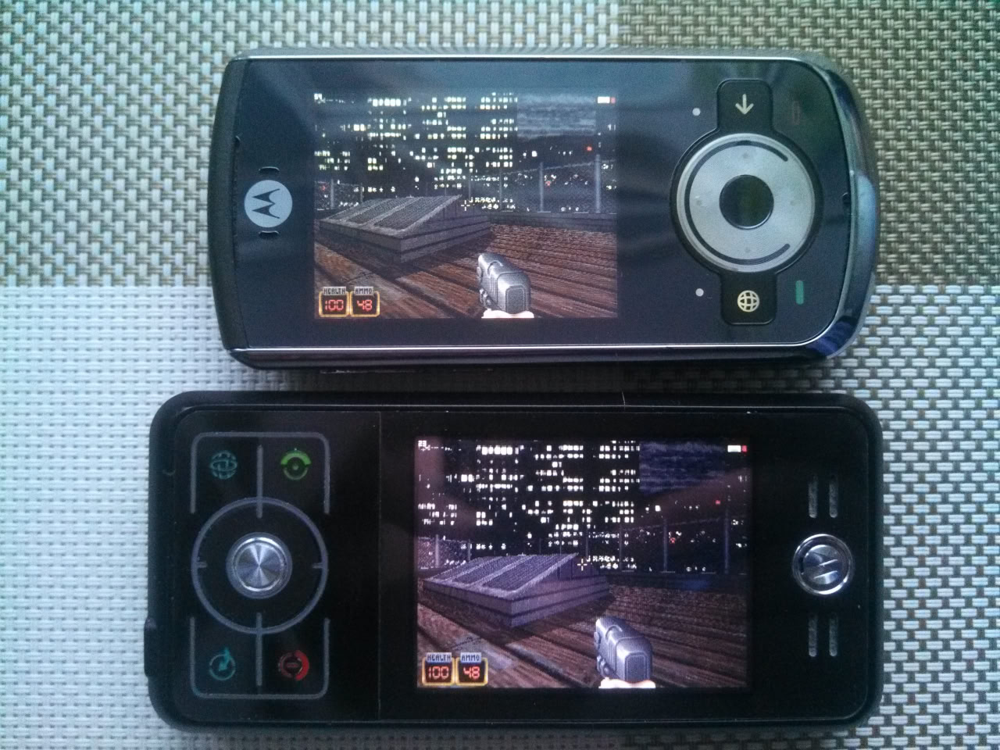

## Download

TODO:

## Install

Simply install the package and place the **duke3d.grp** file next to the **duke3d** executable. Some custom versions may require *.con files from the "cons_general" and "cons_atomic" directories next to the **duke3d** executable.

### MD5 Checksums and Sizes

```bash
c03558e3a78d1c5356dc69b6134c5b55 11035779 duke3d.grp # Shareware version.
981125cb9237c19aa0237109958d2b50 26524524 duke3d.grp # Full version.
22b6938fe767e5cc57d1fe13080cd522 44356548 duke3d.grp # Atomic version.
```

These **duke3d.grp** files were tested.

## Controls

All control keys/buttons can be changed in the "Options" => "Controls..." menu.

### EZX (Motorola ROKR E6)

| Action            | Key               | Alt. Key          |
|-------------------|-------------------|-------------------|
| Move Forward      | "Up"              |                   |
| Move Backward     | "Down"            |                   |
| Turn Left         | "Left"            |                   |
| Turn Right        | "Right"           |                   |
| Fire              | "Vol +"           | "Center"          |
| Open              | "Vol -"           |                   |
| AutoRun           | "Mod" + "Camera"  |                   |
| Jump              | "Send"            |                   |
| Crouch            | "Browser"         |                   |
| Aim Up            | "Mod" + "Up"      |                   |
| Aim Down          | "Mod" + "Down"    |                   |
| Inventory         | "Camera"          |                   |
| Inventory Right   | "Forward"         |                   |
| Map               | "Mod" + "Browser" |                   |
| Center View       | "Mod" + "Center"  |                   |
| Next Weapon       | "Backward"        |                   |
| Back/Esc          | "End"             |                   |

The "Mod" key on the Motorola MING A1200 is located between the "Vol -" and "Vol +" keys, and on the ROKR E6 it is under the "End" button.

### MotoMAGX (Motorola VE66)

| Action            | Key               | Alt. Key          |
|-------------------|-------------------|-------------------|
| Move Forward      | "Up"              |                   |
| Move Backward     | "Down"            |                   |
| Turn Left         | "Left"            |                   |
| Turn Right        | "Right"           |                   |
| Fire              | "Vol +"           | "Center"          |
| Open              | "Vol -"           |                   |
| AutoRun           | "3"               |                   |
| Jump              | "Camera"          |                   |
| Crouch            | "1"               |                   |
| Strafe Left       | "2"               |                   |
| Strafe Right      | "8"               |                   |
| Aim Up            | "6"               |                   |
| Aim Down          | "4"               |                   |
| Weapon "Kick"     | "Backspace"       |                   |
| Inventory         | "*"               |                   |
| Inventory Right   | "7"               |                   |
| Map               | "#"               |                   |
| Center View       | "5"               |                   |
| Next Weapon       | "9"               |                   |
| Back/Esc          | "End"             |                   |

## Build Recipe for PC (Testing Purposes)

```bash
cd src

# 32-bit SDL_mixer library is needed.
cp /usr/lib/i386-linux-gnu/libSDL_mixer-1.2.so.0.12.0 libSDL_mixer.so

CC='gcc -m32' MODERN_GCC=true make
```

### Run it on PC

```bash
# Run string example.
BUILD_FPS=1 BUILD_NOMOUSEGRAB=1 BUILD_WINDOWED=1 ./duke3d
```

## Build Recipe for EZX

```bash
cd src

. /opt/toolchains/motoezx/setenv-a1200.sh

FLAGS='-DEZX -mcpu=iwmmxt -mtune=iwmmxt' make
```

### Create MPKG Package

```bash
cd res

./create_mpkg.sh
```

## Build Recipe for MotoMAGX

```
cd src

. /opt/toolchains/motomagx/setenv-z6.sh

FLAGS='-DMAGX -march=armv6j -mtune=arm1136jf-s -mfpu=vfp' make
```

### Create MGX Package

```bash
cd res

./create_mgx.sh
```

## Useful Links

- [Native Games for MING A1200 and ROKR E6, All games here](https://forum.motofan.ru/index.php?showtopic=139322) (in Russian)
- [Native Games and Emulators for ZINE ZN5, MGX/PEP-packages](https://forum.motofan.ru/index.php?showtopic=170514) (in Russian)
- [Open Handhelds File Archive](https://dl.openhandhelds.org/cgi-bin/gp2x.cgi?0,0,0,0,20,956) (GP2X)

## Credits

- Original Duke Nukem 3D game by 3D Realms.
- [Build engine](https://advsys.net/ken/build.htm) by Ken Silverman.
- Port to UNIX-like systems by icculus.
- GP2X port (Duke2X) by Woogal at [Sector808](http://www.sector808.org/gp2x/duke-nukem-3d-duke2x/).
- EZX and MotoMAGX port by EXL.
